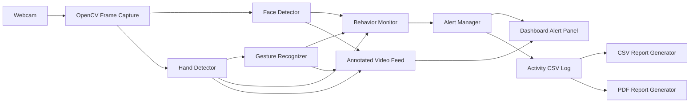
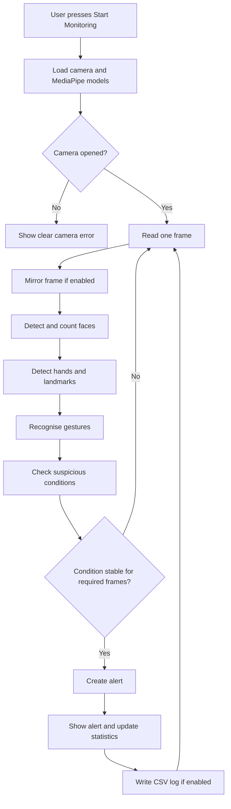

# AI-Powered Exam Monitoring System

> A desktop-based real-time exam monitoring application built with Python,
> OpenCV, MediaPipe, artificial intelligence rules, and CustomTkinter.


## Table of Contents

- [Project Overview](#project-overview)
- [Problem Statement](#problem-statement)
- [Objectives](#objectives)
- [Main Features](#main-features)
- [Technology Stack](#technology-stack)
- [System Architecture](#system-architecture)
- [Monitoring Workflow](#monitoring-workflow)
- [Project Structure](#project-structure)
- [Module Documentation](#module-documentation)
- [Installation](#installation)
- [Running the Project](#running-the-project)
- [Using the Dashboard](#using-the-dashboard)
- [Settings](#settings)
- [Alert System](#alert-system)
- [Activity Logging](#activity-logging)
- [Report Generation](#report-generation)
- [Testing](#testing)
- [Privacy and Security](#privacy-and-security)
- [Troubleshooting](#troubleshooting)
- [Deployment and Packaging](#deployment-and-packaging)
- [Current Limitations](#current-limitations)
- [Future Scope](#future-scope)
- [Viva Questions](#viva-questions)
- [Author](#author)
- [References](#references)

## Project Overview

The AI-Powered Exam Monitoring System monitors a student through a webcam
during an online examination. It processes each camera frame, detects faces and
hands, recognises selected hand gestures, checks suspicious conditions, and
shows alerts on a live desktop dashboard.

The project is designed for an MCA final-year demonstration. The code is split
into small modules so each part can be explained separately during a viva.

### Project Highlights

- Real-time webcam monitoring
- Face detection and continuous face counting
- Face edge, missing face, head turn, and movement checks
- Two-hand detection with 21 landmarks per hand
- Eight hand gesture labels with confidence values
- Stable alerts based on consecutive frames
- Information, warning, and critical alert levels
- CSV activity logging
- Daily CSV and PDF reports
- Persistent camera and sensitivity settings
- Responsive CustomTkinter dashboard
- Automated tests that do not need a webcam

## Problem Statement

Online examinations are difficult to monitor when one invigilator must watch
many students. A student may leave the camera, another person may enter, the
student may repeatedly look away, or suspicious gestures may occur.

This project provides a local monitoring assistant. It does not replace a human
invigilator. It records visible events so the invigilator can review them.

## Objectives

1. Read live video from the student's webcam.
2. Detect and count faces continuously.
3. Detect both hands and all MediaPipe hand landmarks.
4. Recognise common hand gestures with simple explainable rules.
5. Confirm suspicious behavior across several frames to reduce false alerts.
6. Display monitoring status and statistics in real time.
7. Save important events in a structured activity log.
8. Generate a daily CSV or PDF monitoring report.
9. Keep the architecture ready for future AI modules.

## Main Features

| Module | Current Behavior |
|---|---|
| Face Detection | Draws a face box, confidence, and optional face landmarks |
| Face Count | Expects exactly one face and detects zero or multiple faces |
| Frame Position | Detects when the face stays near or outside a camera edge |
| Look-Away Check | Uses nose position between both eyes as a simple head-turn estimate |
| Hand Detection | Detects up to two hands and draws 21 landmarks and connections |
| Hand Movement | Measures wrist movement between consecutive frames |
| Gesture Recognition | Recognises Open Palm, Closed Fist, Pointing Finger, Victory Sign, Thumbs Up, Thumbs Down, Phone Gesture, and Unknown Gesture |
| Suspicious Activity | Checks face missing, multiple faces, looking away, hand covering face, fast hand movement, suspicious gestures, face outside frame, and frequent movement |
| Alerts | Shows INFO, WARNING, and CRITICAL events with cooldown control |
| Logging | Saves date, time, event type, alert type, and description to CSV |
| Dashboard | Shows webcam feed, current statuses, statistics, and alert history |
| Reports | Exports daily CSV and PDF reports |
| Settings | Saves camera, resolution, confidence, alert, preview, and logging choices |

## Technology Stack

### Active Runtime Technologies

| Area | Technology | Purpose |
|---|---|---|
| Programming Language | Python | Main application and monitoring logic |
| Computer Vision | OpenCV | Webcam access, frame processing, drawing, and color conversion |
| AI Landmarks | MediaPipe Tasks 0.10.35+ | Face detection, face landmarks, and hand landmarks |
| Desktop GUI | CustomTkinter | Professional dashboard and settings window |
| Image Display | Pillow | Converts OpenCV frames for Tkinter display |
| Numerical Data | NumPy | OpenCV frame arrays and numerical image operations |
| PDF Reports | ReportLab | Creates formatted daily PDF reports |
| Logging | Python logging | Console messages and rotating system log files |
| Testing | unittest | Automated module tests |

### Extension Packages

The requirements also include Pandas, Matplotlib, and Scikit-learn because they
are part of the planned analytics and anomaly-detection scope. The current live
monitoring rules do not claim to use a trained Scikit-learn model.

## System Architecture



### Architecture Layers

| Layer | Responsibility |
|---|---|
| GUI Layer | Starts/stops monitoring, displays frames, shows alerts, saves settings |
| Detection Layer | Measures faces, hands, positions, landmarks, and movement |
| Recognition Layer | Converts hand landmarks into gesture names |
| Monitoring Layer | Confirms suspicious conditions and creates alerts |
| Report Layer | Reads activity records and creates daily reports |
| Configuration Layer | Stores paths, colors, thresholds, and persistent settings |

## Monitoring Workflow



### Why Consecutive Frames Are Used

A single camera frame may be blurred or temporarily dark. The system waits for
a condition to remain true for a configurable number of frames. This reduces
false alerts while keeping the response fast.

## Project Structure

```text
AI_Exam_Monitoring_System/
|-- app.py
|-- config.py
|-- requirements.txt
|-- README.md
|-- .gitignore
|
|-- detection/
|   |-- __init__.py
|   |-- face_detector.py
|   `-- hand_detector.py
|
|-- recognition/
|   |-- __init__.py
|   `-- gesture_recognition.py
|
|-- monitoring/
|   |-- __init__.py
|   |-- alert_manager.py
|   `-- behavior_monitor.py
|
|-- gui/
|   |-- __init__.py
|   |-- components.py
|   |-- dashboard.py
|   `-- settings_dialog.py
|
|-- reports/
|   |-- __init__.py
|   |-- report_generator.py
|   `-- output/
|
|-- tests/
|   |-- test_alert_manager.py
|   |-- test_behavior_monitor.py
|   |-- test_config.py
|   |-- test_detection_models.py
|   |-- test_gesture_recognition.py
|   `-- test_report_generator.py
|
|-- logs/
|   |-- activity_log.csv       Generated at runtime
|   `-- system.log             Generated at runtime
|
|-- assets/
|   `-- models/
|       |-- blaze_face_short_range.tflite
|       |-- face_landmarker.task
|       `-- hand_landmarker.task
`-- settings.json              Generated after settings are saved
```

## Module Documentation

### `app.py`

- Checks required Python packages before importing the GUI.
- Prints a clear setup message when a package is missing.
- Starts the main `Dashboard` window.

### `config.py`

- Defines project paths and dashboard colors.
- Stores all camera and monitoring settings in `AppSettings`.
- Validates saved values before they are used.
- Loads and saves `settings.json`.

### `detection/face_detector.py`

- Uses MediaPipe Tasks Face Detector for boxes and confidence values.
- Uses MediaPipe Tasks Face Landmarker for landmarks and head-turn estimation.
- Counts visible faces.
- Checks camera edges.
- Measures primary-face movement between frames.

### `detection/hand_detector.py`

- Uses MediaPipe Tasks Hand Landmarker.
- Detects up to two hands.
- Draws all hand landmarks and skeleton connections.
- Creates hand boxes.
- Measures wrist movement between frames.

### `recognition/gesture_recognition.py`

- Receives 21 pixel landmarks per hand.
- Checks which fingers and thumb are extended.
- Applies ordered geometric rules.
- Returns a gesture name, confidence, and suspicious flag.

The confidence is a rule confidence, not a probability from a trained neural
network. This is stated clearly to avoid making a false AI accuracy claim.

### `monitoring/behavior_monitor.py`

- Receives face, hand, and gesture results.
- Counts consecutive suspicious frames.
- Creates an alert only after a condition is confirmed.
- Tracks session violation statistics.
- Produces simple status values for the dashboard.

### `monitoring/alert_manager.py`

- Validates alert levels.
- Prevents repeated alert flooding with cooldown time.
- Maintains a thread-safe dashboard history.
- Writes activity records to CSV when logging is enabled.
- Writes technical messages to a rotating `system.log` file.

### `gui/dashboard.py`

- Builds the CustomTkinter dashboard.
- Runs camera processing in a background thread.
- Uses queues to send safe frame and status updates to Tkinter.
- Provides start, stop, report, clear, and settings controls.

### `gui/components.py`

- Contains the reusable status badge and alert row widgets.
- Keeps small visual components outside the main dashboard file.

### `gui/settings_dialog.py`

- Contains the modal settings form.
- Copies, validates, and sends updated values back to the dashboard.

### `reports/report_generator.py`

- Reads current and older draft log formats.
- Filters records by date.
- Counts warnings, critical alerts, face violations, gestures, and movement.
- Creates daily CSV and PDF files.

## Installation

### 1. Prerequisites

- Windows 10 or Windows 11
- A working webcam
- Python 3.9 or newer
- Git recommended
- Visual Studio Code recommended

The project was verified with Python 3.14.5 and MediaPipe 0.10.35. Python 3.11
or 3.12 is also a practical choice for college lab computers.

### 2. Check Python

```powershell
python --version
```

Expected example:

```text
Python 3.11.x
```

### 3. Open the Project Folder

```powershell
cd "D:\AI_Exam_Monitoring_System"
```

### 4. Create a Virtual Environment

```powershell
python -m venv .venv
```

You do not have to activate the environment. Using its Python executable avoids
PowerShell execution-policy problems.

### 5. Upgrade pip

```powershell
.\.venv\Scripts\python.exe -m pip install --upgrade pip
```

### 6. Install Dependencies

```powershell
.\.venv\Scripts\python.exe -m pip install -r requirements.txt
```

### 7. Verify Important Packages

```powershell
.\.venv\Scripts\python.exe -c "import cv2, mediapipe, customtkinter, reportlab; print('Setup successful')"
```

## Running the Project

Run from the project root:

```powershell
.\.venv\Scripts\python.exe app.py
```

Alternative after activating the virtual environment:

```powershell
python app.py
```

Expected result:

1. The CustomTkinter dashboard opens.
2. The status is `IDLE`.
3. Pressing `Start Monitoring` opens the selected webcam.
4. Face and hand annotations appear in the embedded OpenCV feed.

## Using the Dashboard

### Start Monitoring

1. Close other applications that are using the webcam.
2. Press `Start Monitoring`.
3. Wait for the first camera frame.
4. Keep one face clearly visible.

### Read Status Badges

| Badge | Meaning |
|---|---|
| Face Status | Normal face, missing face, multiple faces, or frame edge |
| Face Count | Current number of detected faces |
| Hand Status | Number of visible hands |
| Gesture | Current gesture name and rule confidence |
| Current Alert | Normal, warning, or critical state |

### Stop Monitoring

Press `Stop`. The worker thread closes the camera before another session starts.

### Clear Panel

`Clear Panel` removes the visible in-memory history. It does not delete the CSV
audit log.

## Settings

The Settings window supports:

- Camera index from 0 to 4
- Camera resolution
- Face detection confidence
- Hand detection confidence
- Missing-face confirmation frames
- Repeated-alert cooldown
- Mirrored camera preview
- Face landmark drawing
- Activity CSV logging

Settings are saved in `settings.json`. This local file is ignored by Git because
camera choices may differ between computers.

## Alert System

| Level | Purpose | Examples |
|---|---|---|
| INFO | Normal application event | Monitoring started, face detected |
| WARNING | Suspicious behavior requiring review | Looking away, suspicious gesture, hand covering face |
| CRITICAL | Strong exam-rule violation | No face or multiple faces |

### Main Event Types

| Event Type | Meaning |
|---|---|
| `FACE_DETECTED` | First normal face was detected |
| `FACE_MISSING` | No face remained visible long enough to confirm |
| `MULTIPLE_FACES` | More than one face remained visible |
| `FACE_OUTSIDE_FRAME` | Face remained too close to a frame edge |
| `LOOKING_AWAY` | Head-turn estimate remained above the threshold |
| `HAND_COVERING_FACE` | Hand box covered enough of the face box |
| `EXCESSIVE_HAND_MOVEMENT` | Fast wrist movement continued across frames |
| `FREQUENT_MOVEMENT` | Main face position changed rapidly across frames |
| `SUSPICIOUS_GESTURE` | Phone or victory gesture remained visible |

## Activity Logging

Activity records are stored in:

```text
logs/activity_log.csv
```

CSV columns:

| Column | Example |
|---|---|
| Date | `2026-06-13` |
| Time | `10:15:20` |
| Event Type | `FACE_MISSING` |
| Alert Type | `CRITICAL` |
| Description | `No face is visible...` |

Technical errors and application messages are stored in:

```text
logs/system.log
```

The system log rotates automatically so one file does not grow forever.

## Report Generation

### CSV Report

Press `Export CSV`. The report is saved in:

```text
reports/output/exam_report_YYYY-MM-DD.csv
```

### PDF Report

Press `Export PDF`. The report contains:

- Report date and generation time
- Total warning and critical alerts
- Information event count
- Face violation count
- Gesture violation count
- Movement violation count
- Full daily activity table

PDF files are saved in:

```text
reports/output/exam_report_YYYY-MM-DD.pdf
```

## Testing

The automated tests do not open a webcam. They verify settings, gesture rules,
alerts, behavior confirmation, logging, and reports.

Run all tests:

```powershell
python -m unittest discover -s tests -v
```

Current result:

```text
Ran 19 tests
OK
```

### Manual Camera Test

1. Start monitoring with one face visible.
2. Confirm face count is 1.
3. Move out of the camera for several frames.
4. Confirm a critical missing-face alert appears.
5. Ask another person to enter the frame.
6. Confirm a multiple-face alert appears.
7. Show each supported hand gesture.
8. Export CSV and PDF reports.
9. Open both report files and confirm today's events are present.

## Privacy and Security

- Video frames are processed locally.
- The current version does not upload webcam frames to a cloud service.
- The current version does not store video recordings.
- Activity logs contain event text and times, not raw images.
- Generated logs and reports are ignored by Git.
- No API key, password, token, or secret is required.
- Users should be told clearly when monitoring is active.
- Institutions must follow local privacy and examination policies.

## Troubleshooting

### `ModuleNotFoundError: No module named 'mediapipe'`

Install dependencies inside the project virtual environment:

```powershell
.\.venv\Scripts\python.exe -m pip install -r requirements.txt
```

If installation fails on one Python version, install Python 3.11 or 3.12 and
recreate `.venv` with that version.

### `ModuleNotFoundError: No module named 'customtkinter'`

```powershell
.\.venv\Scripts\python.exe -m pip install customtkinter
```

### Webcam Cannot Open

1. Close Camera, Teams, Zoom, browser calls, and other webcam applications.
2. Check Windows camera privacy permission.
3. Open Settings and try camera index 1 or 2.
4. Disconnect and reconnect an external webcam.

### Camera Feed Is Slow

- Use `640 x 480` resolution.
- Disable face landmark drawing.
- Close other high-CPU applications.
- Use good lighting.

### Too Many False Alerts

- Increase the missing-face confirmation frames.
- Reduce face or hand detection confidence carefully.
- Increase repeated-alert cooldown.
- Improve lighting and keep the webcam stable.

### PowerShell Blocks Virtual Environment Activation

Use the environment's Python directly:

```powershell
.\.venv\Scripts\python.exe app.py
```

### PDF Export Fails

```powershell
.\.venv\Scripts\python.exe -m pip install reportlab
```

## Deployment and Packaging

This is a local desktop application. Vercel and Render are not suitable for the
live webcam GUI because they run web or server applications.

For another computer:

1. Copy or clone the repository.
2. Install Python 3.11 or 3.12.
3. Create a virtual environment.
4. Install `requirements.txt`.
5. Run `app.py`.
6. Select the correct camera index.

An optional future release can use PyInstaller to create a Windows executable.
That executable must be tested carefully because MediaPipe includes native model
files that need to be packaged correctly.

## Current Limitations

- This is a monitoring assistant, not a replacement for a human invigilator.
- Look-away detection is a simple head-turn estimate, not full eye tracking.
- Gesture confidence is rule-based, not a trained model probability.
- Poor lighting, masks, camera blur, and low-quality webcams reduce accuracy.
- The system does not identify who the detected face belongs to.
- The current version does not record video or audio.
- It does not provide a remote cloud dashboard.
- It does not use a trained anomaly-detection model yet.
- Physical webcam behavior cannot be fully verified by automated tests alone.

## Future Scope

- Eye tracking with iris landmarks
- Full head pose estimation
- Voice and background-noise monitoring
- Emotion recognition with ethical safeguards
- Trained behavior anomaly detection
- Identity verification before an exam
- Encrypted exam recording
- Remote invigilator dashboard
- Multi-student monitoring server
- Institution login and exam scheduling
- Configurable evidence screenshots after user consent
- Database-backed reports and analytics

## Viva Questions

### Why is OpenCV used?

OpenCV opens the webcam, reads frames, flips images, changes color format, and
draws boxes and text.

### Why is MediaPipe used?

MediaPipe provides fast face and hand landmark models that can run on a normal
computer without training a model from the beginning.

### Why does the project use threads?

Camera detection takes time. Running it in a background thread prevents the
Tkinter dashboard from freezing.

### Why are queues used?

Tkinter widgets should be updated from the main thread. Queues safely move the
newest frame and status from the camera thread to the GUI thread.

### How are false alerts reduced?

The behavior monitor requires a condition to remain true for several
consecutive frames and uses a cooldown before repeating the same event.

### Is gesture confidence produced by machine learning?

No. It is a fixed confidence assigned to an explainable geometric rule. A
future version can replace it with a trained classifier and real validation
metrics.

### Where is exam activity stored?

Alerts are stored in `logs/activity_log.csv`. Technical messages are stored in
`logs/system.log`.

## Author

**Suvodeep Roy**

For project questions, use the GitHub repository issue tracker after a remote
repository is connected.

## References

- [Python Documentation](https://docs.python.org/3/)
- [OpenCV Documentation](https://docs.opencv.org/)
- [MediaPipe Python Setup](https://ai.google.dev/edge/mediapipe/solutions/setup_python)
- [MediaPipe Package Metadata](https://pypi.org/project/mediapipe/)
- [CustomTkinter Documentation](https://customtkinter.tomschimansky.com/documentation/)
- [Pillow Documentation](https://pillow.readthedocs.io/)
- [ReportLab Documentation](https://docs.reportlab.com/)

---

This repository documents the current implementation honestly. Features listed
under Future Scope are not presented as completed features.
